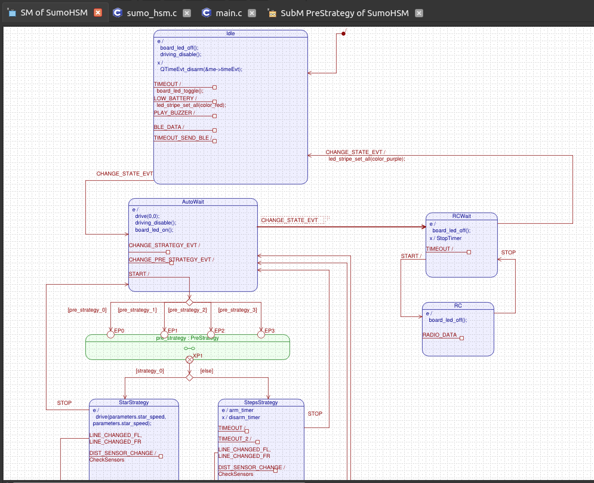

# Robot-Sumo-Simulator

This is a robot-sumo C program that runs both on a target hardware and on a PC machine. When running on a PC, we use a Python program to send inputs (e.g distance sensors) and receive outputs (e.g Motor data) from the C code.

The simulator have the following functionalities: distance sensor simulation, line sensor simulation, motor simulation, bluetooth simulation, start module simulation, buzzer simulation, button and led simulaiton, RF radio simulation and EEPROM simulation

The aim of this project is to allow robot sumo programmers to test their codes, without depending on the hardware or mechanical structure of the robot. Also to build a code-independant plataform that would be easy to port to another hardware if needed.

The project also includes a state machine code generator (QM tool). This allows programmers to focous on the high level behaviour of the robot, while the state machine low level is done automatically.

The code was based on QP™ Real-Time Embedded Frameworks (RTEFs) from https://www.state-machine.com/. In this makefile we give a rough view of the usage. But for a complete understanding it is recomended to read the official docs and [videos](https://www.youtube.com/@StateMachineCOM)


## Table of contents
* [Requirements](#requirements)
* [Folder Structure](#folder-structure)
* [PC Simulator](#pc-simulator)
* [STM32 specific configuration](stm32-specific-configuration)
* [State Machine And Code generation](#state-machine-and-code-generation)
* [Extras](#extras)
* [QM License](#qm-license)


## Requirements

The progrram was devolped and tested on Linux. All the used tools are also available for windows, but those were not tested, so some problems may appear on the first configuration.

Used tools:
* [GNU Make](https://www.gnu.org/software/make/) for automated building. No particular version recommended.
* [GNU ARM Embedded Toolchain](https://developer.arm.com/open-source/gnu-toolchain/gnu-rm) for building C source code for the STM32 hardware platform. Version 10-2020-q4-major used.
* [Python 3](https://www.python.org/downloads/)
* [QPC Bundle](https://www.state-machine.com/). This project was developed on version 7.1.2, so this is the recommended version. This will install QP/C, QM and Qview.

## Folder Structure
    .                                 
    ├── build_spy                     #  Compiled Files For SImulator          
    ├── build                         #  Compiled Files for STM32 target
    ├── config.mk                     #  STM32 Config for microcontroller STM32F103RFT6
    ├── config_substitute.mk          #  STM32 Config for microcontroller STM32F103RCT6                      
    ├── cube                          #  CubeMX Files for STM32                         
    ├── inc                           #  Header Common Files    
    │   ├── bsp                       #  Board Support Package Files
    │   │   ├── target-pc             #  Header Files specific for Simulator
    │   │   └── target-stm32f103      #  Header Files specific for STM32F103
    ├── LICENSE.md                    #  License File      
    ├── Makefile                      #  Makefile
    ├── qview                         #  Folder Containing the Python Simualtor
    ├── README.md                     #  This readme           
    └── src                           #  Source Common Files   
        ├── bsp                       #  Board Suport package files
        │   ├── target-pc             #  Source Files specific for Simulator
        │   └── target-stm32f103      #  Source Files specific for STM32F103                                      
    ├── state-machine.png             #  State Machine Photo                   
    └── sumo_hsm.qm                   #  State Machine File for qm program

## PC Simulator

#### Configs

Download QPC bundle from https://www.state-machine.com/ (This will include QP/C, QP/C++ and QTools). Or download separatadely from github https://github.com/QuantumLeaps

After that include QPC downloaded path to the environment variables editing ~/.bashrc file: 
```
export QPC="/home/user/qp-linux_7.1.2/qp/qpc
```

Also add QTOOLS as follows: 
```
export QTOOLS="/home/user/qp-linux_7.1.2/qp/qtools
```
```
export PATH="/home/user/qp-linux_7.1.2/qp/qtools/bin:$PATH"
```

Finally, it is necessary to build qspy tools into /home/user/qp-linux_7.1.2/qp/qtools/bin folder.
```
$ cd ~/qp-linux_7.1.2/qp/qtools/qspy/posix/
$ make
```

This will automatically build qspy into qp/qtools/bin folder.

The last tool needed is qview. You can install via ```pip install qview```, or use as a standalone file that is located ```cd ~/qp-linux_7.1.2/qp/qtools/qview/```.

#### Qspy
The installed qspy tool, is used as a server to join a C program and a Python program. Referece: https://www.state-machine.com/qtools/qpspy.html#ab_about

#### Qview
The installed qview tool, is used as a front-end aplication to vizualize commands received on Qspy. Also it can send command to qspy. Referece: https://www.state-machine.com/qtools/qview.html

#### Environemnt variables
Add the following environment variables to the ~/.bashrc file
```
export QPC="/home/user/qp-linux_7.1.2/qp/qpc"
export QTOOLS="/home/user/qp-linux_7.1.2/qp/qtools"
```
#### Python libs
```
pip install tk
sudo apt-get install python3-pil python3-pil.imagetk
pip install pynput
pip install inputs
pip install bluezero

```

#### Compilinig the code
To compile the code to run on a PC simply urn the following command:
```
make CONF=spy
```

this will build the binaries on build_spy folder.


#### Running
With all the configuration done, it should be possible to run the project on a PC. 
* Open 3 terminals
* Run qspy command on one terminal
* Run the simulator on another terminal using:
```
python3 ./qview/simulator_base.py
```
* Run the C code that will connect to the simulator on another terminal:
```
./build_spy/sumo_hsm
```

#### Usage
The program, follows a state machine behaivour that will be described on "QM State machine" of this document. But basically you can press "3" on the keyboard to generate a "CHANGE_STATE_EVT" that will change the Sumo state machine between "IDLE", "AUTO WAIT" and "RC WAIT".

In "IDLE" mode, the white led is blinks every 500ms ON, and the other leds are purple. Pressing "3" will change state.

In "AUTO WAIT" mode, the white led is always ON, and the other leds are red. Pressing start button on the screen will start AUTO mode. It will start with a default strategy. Pressing "4" on "AUTO WAIT" mode will change the robot strategy. And pressing "6" will change the start strategy. To stop "AUTO" mode, press "STOP" button on the screen.

In "RC WAIT" mode, the white led keeps toggling very fast, and the other leds are blue. Pressing start button on the screen will start RC mode. To controll the robot use the arrows on the keyboard. To stop this mode press "STOP".

Maybe the movement of the robot is not perfect in our machine. This must be because the parameters configurations. See parameters.c file and simulated_eeprom.txt file to change those values.

## STM32 specific configuration
This project was made to work on a STM32 target as well as on a PC. So the folder structure and makefile are designed to use with STM32 microcontrollers. But one can adapt to any microcontroller.

Here I will discuss STM32 specific details.

#### Environemnt variables


If the project will also be used on STM microcontrollers, also add:
```
export ARM_GCC_PATH="/home/user/gcc-arm-none-eabi-10.3-2021.10/bin"
export CUBE_PATH="/home/user/STM32CubeMX"
export CUBE_PROGRAMMER_PATH="/home/user/STMicroelectronics/STM32Cube/STM32CubeProgrammer/bin"
```
Where "CUBE_PATH" is the installed location of STM32CUbeMX tool, and "CUBE_PROGRAMMER_PATH" the cube programmer path. Those are used to flash the program, and set some configs.


#### Cube configs
When buiding CubeMX projects, remove the following interrupts from auto code generate ```PendSV_Handler```, ```NMI_Handler```, ```SysTickhandler```

#### From Cube to Compiled Code
On "./cube" folder we have the .ioc project. There are two folders, because this project was made for two microcontrollers. One can use those examples to change the microcontroller for a specific need.

In each one of those folders, there is the .ioc CubeMX file and all auto generated cube code.

After edditing some .ioc file with CubeMX and cliking on "generate code", run the command ```make prepare``` on the root of this directory to place everything on its correct location.

Note that the makefiles includes a "config.mk" file. It is necessary to edit this file when changing the microcontroller.

After that, we can already compile the code with make command on the root of the repository:

```
$ make
```

This will generate a compiled .elf and .hex file on "build" folder. This code can be flashed on a microcontroller using:
```
$ make flash
```

#### Usage
Same as on the simulator but now with real hardware

## State Machine And Code generation

The file sumo_hsm.qm contains all the state machine code of the project. This state machine is the same when using PC or Hardware target. To edit the state machine use the "qm" tool installed with QPC bundle.

To run, use:
```
./qm.sh project-location/sumo_hsm.qm
```
Command from the /home/user/qp-linux_7.1.2/qp/qm/bin folder.

On the first usage first type:
```
chmod u+x qm
chmod u+x qm.sh
```

For more information read "README.md" doc on qm folder.

Also add a license to use the program. See [QM License](#qm-license)

Now using this program, you can edit the state machine. For more details visit https://www.state-machine.com/qm/index.html.


After eding the state machine, annd clicking on "Tools >> Generate code" the code for the state machine will be generated on "sumo_hsm.c" file.


Below a image of the current state machine:


## Extras
#### Bluetooth Simulation

The project alsos counts with a BLE emulator with python. It is possible to simulate BLE services and characteristics to comunicate with the simulator. See qview/ble_server/ble_server.py file.

To use:
```
python3 qview/ble_server/ble_server.py
```

#### Using PS3 Controller
It is possible to use a PS3 controller to control the robot and send events to the code. For this, connect a PS# controller on the PC and change "USE_PS3_CONTROLLER = False" to "USE_PS3_CONTROLLER = True" on "qview/simulator_custom.py" file.


#### Real Robot

This code is used on my team robot sumo project. More information on:
* https://www.youtube.com/@raijuteam1004
* https://github.com/team-raiju


# QM License
The state machine was built using QMActive scheme. So it is necessary to use a paid license when developing closed-source projects. In this case we are using the free trial license located on qp-linux_7.1.2/qp/qpc/LICENSES/QM-EVAL-QPC.qlc.

On the first time running the project, it will be necessary to update the license path on the user computer. It is possible to change on the qm interface, or by edintig line 4 on ```sumo_hsm.qm``` file:
```
<framework name="qpc" license="../../../../qp-linux_7.1.2/qp/qpc/LICENSES/QM-EVAL-QPC.qlc"/>
```

More information on: https://state-machine.com/qm/sm.html#sm_class
